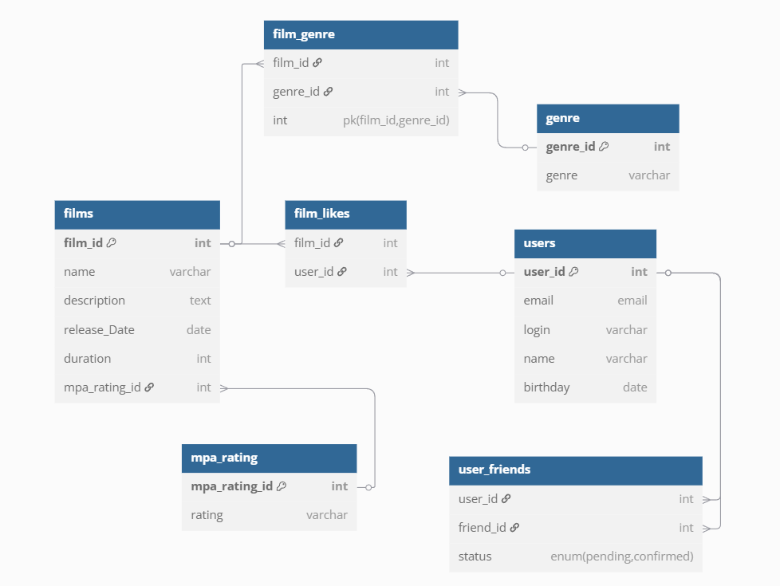

# java-filmorate
Template repository for Filmorate project.
## ER-диаграмма



---
## Описание схемы
База данных предназначена для хранения фильмов, пользователей,оценок,связи между ними.

### Таблицы

1. **film**
    - Содержит данные о фильмах: название, описание, дата выпуска, продолжительность, жанры, рейтинг MPA.
2. **film_genre**
     -Связь фильма и его жанров
3. **genre**
    - Список жанров
4. **mpa_rating**
    - Возрастные рейтинги (например, "G", "R")
5. **user**
    - Хранит данные пользователей: email, логин, имя, дата рождения.
6. **user_friends**
    - Хранит связи дружбы между пользователями и их статусы (подтвержденная/неподтвержденная).
7.  **film_like**
    - Лайки пользователей к фильмам

### Связи

- Фильмы и жанры связаны через `film_genre`.
- Фильмы имеют один рейтинг MPA (`mpa_rating`).
- Пользователи ставят лайки фильмам через `film_like`.
- Дружба между пользователями управляется через `friends`

---

## Примеры запросов


### - Добавление фильма

```sql
INSERT INTO film (name, description, release_date, duration, mpa_rating_id)
VALUES ('Spider Man', 'Боевик,драма', '2002-04-30', 121, 5);
```

### - Поиск всех друзей пользователя

```sql
SELECT u.name
FROM user_friends f
JOIN user u ON f.friend_id = u.user_id
WHERE f.user_id = 1 AND status = 'confirmed';
```
